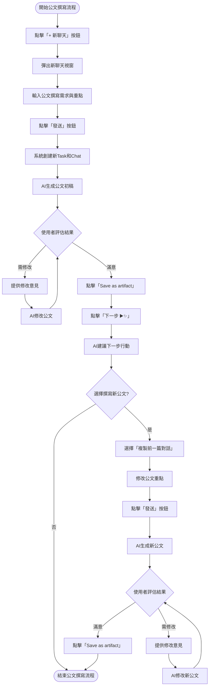

```
# 寫公文(簡單工作，單一chat即可實現)

## 初始chat

【new chat】task1/chat1:請AI依照幾個重點寫公文，包含注意事項 -> 循環直到滿意

## 沿用前面的chat，寫另一篇公文

【copy chat】task1/chat2:修改重點，執行 -> AI生成

---

說明：
【operation】 代表使用者的操作
【next】: 下一步

---

# 指示

請參考 app 設計, UI, UX設計，編寫、完善上面的 UX 流程，給予流程圖，搭配適當說明

- 可能需要多個任務，適當的拆分任務
- 基於拆分任務，請先規劃、描述最終的 workspace structure tree
- 流程可適度簡化、省略
- 流程要清晰易懂，方便讓其他開發者閱讀
- 主要目的就是在展示這個 app 可以怎麼幫助目標用戶，解決用戶通點
- 流程圖用 mermaid 編寫
```

# AI輔助工作流程應用程式 - 公文撰寫UX流程

## 最終 Workspace 結構

```
/(Workspace) 公文撰寫專案
├── /(task) 公文模板與規範
│   ├── (entrypoint) chat_模板設定.v1.json
│   ├── artifact_公文通用模板.v1.md
│   └── artifact_公文撰寫規範.v1.md
├── /(task) 正式公文撰寫
│   ├── (entrypoint) chat_會議紀錄.v1.json
│   ├── artifact_會議紀錄公文.v1.md
│   ├── chat_會議紀錄.v2.json
│   ├── artifact_會議紀錄公文.v2.md
│   ├── chat_計畫書.v1.json
│   └── artifact_計畫書公文.v1.md
└── /(task) 公文範本收藏
    ├── artifact_核銷公文範本.v1.md
    ├── artifact_會議通知範本.v1.md
    └── artifact_請假申請範本.v1.md
```

## 核心UX流程圖



## 詳細UX流程說明

### 1. 初始公文撰寫

#### 1.1 創建任務與初始對話

1. 使用者在主頁點擊「+ 新聊天」按鈕（位於左側欄）
2. 彈出新聊天視窗，預設為「Chat模式」並勾選「創建新Task」
3. 使用者輸入公文撰寫需求：

```
請幫我撰寫一份會議紀錄公文，要包含以下重點：
1. 會議時間：2025年4月15日 14:00-16:00
2. 會議地點：第三會議室
3. 出席人員：王部長、李科長、張經理等共8人
4. 會議主題：第二季營運計畫討論
5. 主要決議：
   - 增加研發預算20%
   - 6月前完成新產品原型
   - 調整銷售策略，強化線上銷售渠道

注意事項：
- 公文格式需符合機關標準格式
- 用詞需正式且精準
- 以第三人稱客觀描述
- 重點需突出清晰
```

4. 使用者點擊「發送」，系統創建新的任務資料夾（Task）及對話檔案（Chat）

#### 1.2 AI回應與反饋循環

1. AI分析需求並生成公文初稿
2. 使用者檢視初稿：
   - 若滿意：點擊AI回應下方的「Save as artifact」按鈕，系統將公文保存為`artifact_會議紀錄公文.v1.md`
   - 若需修改：使用者提供具體修改意見：

```
請調整以下幾點：
1. 第二段太冗長，請精簡
2. 將決議部分改為項目符號列表
3. 加入下次會議時間：5月1日 14:00
```

3. AI根據反饋修改公文
4. 使用者繼續提供反饋，循環直到滿意
5. 最終版本保存為`artifact_會議紀錄公文.v2.md`

### 2. 使用「Summarize」功能

1. 公文確認完成後，使用者點擊「Summarize ✨」按鈕
2. AI自動分析對話內容，生成摘要，重點包括：
   - 文件類型（會議紀錄公文）
   - 主要內容（會議時間、地點、參與者、決議等）
   - 使用者關注的重點（格式要求、用詞風格等）
3. 系統將摘要顯示在聊天視窗中：

```
[Summarize ✨] 已將摘要儲存為: [chat_會議紀錄_summary.v1.md]
```

4. 此摘要可在未來撰寫類似公文時作為參考

### 3. 使用「下一步」功能撰寫新公文

1. 使用者點擊「下一步 ▶️✨」按鈕
2. 系統彈出「下一步」視窗，顯示AI建議的後續行動：

```
下一步
（AI建議）
[撰寫後續會議通知]
[建立會議紀錄模板]
[撰寫其他類型公文]

<task_knowledge>
#artifact_會議紀錄公文.v2.md
#chat_會議紀錄_summary.v1.md
</task_knowledge>
<task_instruction />

Prompt...
```

3. 使用者選擇「撰寫其他類型公文」，修改Prompt為：

```
請依照類似格式，幫我撰寫一份計畫書公文，要包含以下重點：
1. 計畫名稱：2025年度研發創新計畫
2. 計畫期間：2025年7月至12月
3. 計畫預算：500萬元
4. 計畫目標：
   - 開發兩項新產品原型
   - 申請三項專利
   - 提升生產效率15%
5. 執行單位：研發部、製造部

注意事項同前，保持公文風格一致。
```

4. 使用者點擊「Submit」，系統創建新的Chat（`chat_計畫書.v1.json`）

### 4. 重複利用先前Chat

除了使用「下一步」功能外，使用者也可以直接複製先前的Chat：

1. 在左側Explorer欄中找到`chat_會議紀錄.v2.json`
2. 右鍵點擊，選擇「複製」或點擊「⋮」選單後選擇「複製」
3. 系統創建副本`chat_計畫書.v1.json`
4. 使用者修改Prompt中的重點內容
5. 點擊「發送」，AI生成新公文
6. 使用者提供反饋，循環直到滿意
7. 最終版本保存為`artifact_計畫書公文.v1.md`

## 高級功能體驗

### 1. 模板管理與使用

使用者可以通過創建專用模板，進一步提高公文撰寫效率：

1. 創建新任務「公文模板與規範」
2. 與AI討論並確立通用模板
3. 保存為`artifact_公文通用模板.v1.md`
4. 在後續公文撰寫中，使用`#artifact_公文通用模板.v1.md`引用該模板：

```
請根據 #artifact_公文通用模板.v1.md 的格式，撰寫一份請假申請公文...
```

### 2. 知識庫引用

使用者可以引用專案中的其他文件作為知識來源：

```
<task_knowledge>
#artifact_公文撰寫規範.v1.md
#artifact_會議紀錄公文.v2.md
</task_knowledge>

請參考上述文件，撰寫一份商業合作提案公文...
```

### 3. 版本控制

當使用者修改已發送的Prompt時，系統自動創建新版本，保留修改歷史：

1. 使用者在已完成的對話中點擊「edit」按鈕
2. 修改內容後重新發送
3. 系統自動創建新版本，如`chat_會議紀錄.v1.json`→`chat_會議紀錄.v2.json`

## 如何解決用戶痛點

這個公文撰寫UX流程設計主要解決以下用戶痛點：

### 1. 降低起始阻力

**痛點**：開始撰寫公文時常面臨「不知從何下手」的問題。

**解決方案**：提供結構化的對話框架，使用者只需填入關鍵要點，AI即可生成完整初稿。

### 2. 減輕認知負擔

**痛點**：「下一步該做什麼」的困惑常導致工作效率下降。

**解決方案**：「下一步 ▶️✨」功能自動分析當前進度，主動推送下一步建議，降低使用者的認知負擔。

### 3. 簡化迭代過程

**痛點**：公文修改常需要重複性工作，來回調整耗時費力。

**解決方案**：AI能根據具體反饋快速修改，版本控制功能保留修改歷史，避免重複工作。

### 4. 提高工作重用性

**痛點**：類似公文常需重新撰寫，無法有效重用先前工作。

**解決方案**：

- 「複製」功能允許在保留框架的同時修改內容
- 模板管理功能使常用公文結構可重複使用
- Summarize功能提取關鍵知識，便於日後參考

### 5. 減少文件切換

**痛點**：撰寫公文時常需在多個文件間切換參考，影響連貫性。

**解決方案**：`#檔案路徑`引用系統使相關資料可直接在對話中訪問，減少上下文切換。

## 結論

此UX流程設計充分體現了「Push not pull」的設計理念，讓AI在公文撰寫過程中主動推動工作流程，使用者只需在關鍵節點提供指導和決策。系統通過降低認知負擔、簡化操作流程和提高工作重用性，有效解決了公文撰寫過程中的常見痛點。

同時，半自動化的設計保留了使用者對最終成果的控制權，確保公文內容符合特定需求和質量標準。這種平衡既提高了效率，又保證了公文撰寫的質量和準確性。
